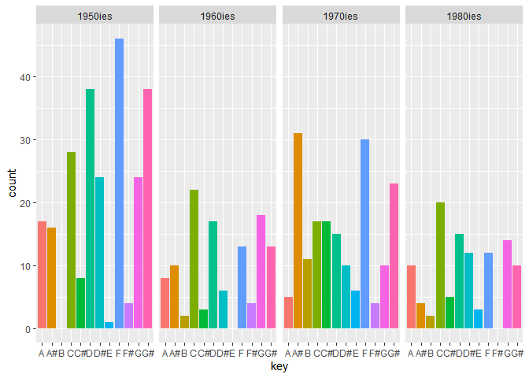
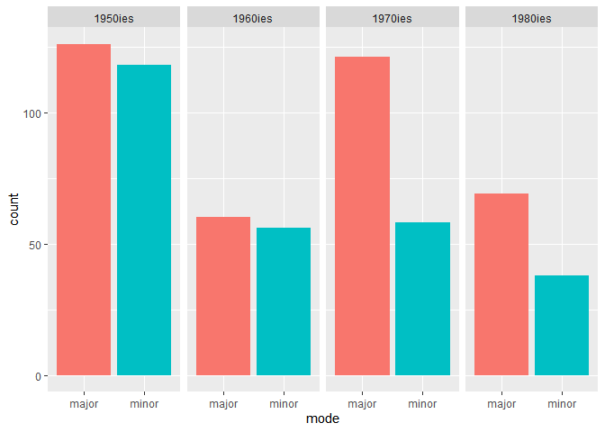

Corpus MilesDavis CompMu 2020
================
Willem Pleiter
2020

### **The Miles Davis Corpus**

For my corpus I have decided to investigate the jazz trumpet player
Miles Davis. Davis is known within the jazz and global community as a
constant innovator and key figure of jazz music. His method for
innovation was to constantly attract upcoming talents and stars within
the upcoming current in jazz. He then instructed these youngsters with
his own vision of jazz and this was reciprocated by the youngsters how
provided him with their own new views.

In my corpus I will try to analyse Davis’ music by answering some of the
following questions:

  - How did Davis’ music change over time, what are the constants in his
    music and what are the variables?

  - How did Davis’ music reflect other albums of each specific time
    period that he was adapting to?

The following phases of Miles Davis’ oeuvre could be examined

  - Early bebop/ Charlie Parker phase

  - Hard Bop phase: (Miles Davis quartet with Horace Silver, Max Roach,
    Charles Mingus, Art Blakey)

  - Gil Evans orchestral phase (Sketches in Spain)

  - Miles Davis first quintet (Coltrane, Adderley, Evans, Kelly). This
    coincides with Gil Evans

  - Miles Davis second quintet (Carter, Hancock, Williams, Shorter)

  - Miles Davis electric/funk fusion (Corea, Jarrett) (Bitches Brew,

  - Miles Davis post 80ies Hip-hop modern contemporary phase

I intend to use atleast one album of each period and compare them to
each other and perhaps compare them to other big albums. This comparison
will be mostly analysed through spotify data, but when allowed I would
like to also harmonically and culturally analyse them. For instance, I
know that Miles Davis was heavily influenced by Ahmad Jamal prior to his
Cool Jazz phase, which could be interesting to compare.

#### **Preliminary Analysis**

For the preliminary analysis, I will just get the entire discography of
Miles from Spotify and run some general statistic analyses:

loading libraries

``` r
# Load libraries (every time)

library(tidyverse)
library(spotifyr)
library(ggplot2)
source('spotify.R')
```

**Audio Features** <br> Getting the entire Miles Davis catalogue. This
is a very rough representation of his statistics, since a lot of
compilation albums, posthumous releases containing the same tracks are
included.

``` r
miles_davis <- get_artist_audio_features("Miles Davis")
```

**Histograms** <br> Showing Histograms of the main audio features of all
songs:
<!-- --><!-- -->

Here are the histograms of music features like key, mode, tempo of each
song

``` r
par(mfrow = c(2,2))
plot(table(miles_davis$key), main = "Miles Davis Key", xlab = "key, C = 1, C# = 2 etc.", ylab = "Frequency")
hist(miles_davis$mode, main = "Miles Davis Mode", xlab = "Mode (0 = minor, 1 = major)")
hist(miles_davis$tempo, main = "Miles Davis Tempo", xlab = "Tempo in bpm")
```

<!-- -->

**Descriptive statistics and outliers** <br> Here are some descriptive
statistics:

#### Week 7

In this week I want to further get into my preliminary analysis by using
ggplot. The following goals are formulated: - Filter out
compilation/posthumous albums

  - Subset data according to decades

  - Create plots comparing different characteristics from each decade

**Ggplot** <br> Working with ggplot to plot danceability vs popularity
scatterplot and valence added as
well.

``` r
Dance_v_pop <- ggplot(miles_davis, aes(x = danceability, y = energy, color = valence)) + geom_point()
Dance_v_pop
```

<!-- -->

**Subsets** <br> Lets create subsets based on decades:

``` r
#50ies
miles_50s <- subset(miles_davis, album_release_year > 1950 & album_release_year < 1960)
miles_50s$Time_Period <- "1950ies"

#60ies
miles_60s <- subset(miles_davis, album_release_year > 1959 & album_release_year < 1970)
miles_60s$Time_Period <- "1960ies"

#70ies
miles_70s <- subset(miles_davis, album_release_year > 1969 & album_release_year < 1980)
miles_70s$Time_Period <- "1970ies"

#80ies_todeath
miles_80s <- subset(miles_davis, album_release_year > 1979 & album_release_year < 1992)
miles_80s$Time_Period <- "1980ies"


miles_decades <- rbind(miles_50s, miles_60s, miles_70s, miles_80s)
```

Making Facet grids based on
decade

``` r
ggplot(miles_decades, aes(x = danceability, y = energy, col = valence)) + 
  geom_point(size = 3, alpha = 0.6) +
  facet_wrap(. ~ Time_Period)
```

<!-- -->

**Barplots and descriptive statistics** <br> Checking keys with
barplots:

``` r
ggplot(miles_decades, aes(key_name, fill = key_name)) + 
  geom_bar() + 
  theme(legend.position = "none") + 
  labs(x = "key") + 
  facet_grid(. ~ Time_Period)
```

<!-- --> Checking
modes:

``` r
ggplot(miles_decades, aes(as.factor(mode_name), fill = as.factor(mode_name))) + 
  geom_bar() + 
  theme(legend.position = "none") + 
  labs(x = "mode") + 
  facet_grid(. ~ Time_Period)
```

<!-- -->

Comparing means with a barplot:

    ## Warning: package 'gridExtra' was built under R version 3.6.2

    ## 
    ## Attaching package: 'gridExtra'

    ## The following object is masked from 'package:dplyr':
    ## 
    ##     combine

<!-- -->

**Conclusion Week 7** <br> This week I’ve created subsets and found some
interesting differences between decades with regards to acousticness,
energy and liveness and I can already get a pretty clear picture of each
decade. However the decade subset is still a bit arbitrary, perhaps some
historic research is required to correctly split the time periods to
reflect Miles’ innovations. Furthermore the following could be done: -
Get audio-analysis features from spotify or track popularity data
(although not historic)

  - Subset time periods more accurately

  - maybe start with running some statistical tests or analysis

  - formulate hypotheses about what you want to test and why.

  - include some examples via Spotify Embed, polish up portfolio and
    start to actually create a timeline.

#### Week 8

**Subsets version 2 (week 8** <br> I’ve done some research and created
the following subsets based on historical data when Miles switched
quartets and genres (according to wikipedia:

``` r
#Miles_Parker(1944-1950)

miles40ies <- get_playlist_audio_features("Wpleiter", "1v8oL4Clr0LliAh6HNK4C2")
miles40ies_cut <- as.data.frame(miles40ies[,c(6:16)])
miles40ies_cut$Time_Period <- "1944-1950"
#1950-1955
Miles_early_50s <- get_playlist_audio_features("Wpleiter", "3lv2u17pbcXIoNZZtP8wZ5")
milesE50ies <- as.data.frame(c(Miles_early_50s[,c(6:16)]))
milesE50ies$Time_Period <- "1951-1954"

#first quintet and 1955-1962
milesmodal <- subset(miles_davis, album_release_year > 1954 & album_release_year < 1963)
milesmodal_short <- as.data.frame(milesmodal[,c(9:19)])
milesmodal_short$Time_Period <- "1955-1962"


#second quintet 1963-1968
miles_herbie <- subset(miles_davis, album_release_year > 1963 & album_release_year < 1969)
miles_herbie_short <- as.data.frame(miles_herbie[,c(9:19)])
miles_herbie_short$Time_Period <- "1963-1968"

#Milesfusion:
miles_fusion <- subset(miles_davis, album_release_year > 1969 & album_release_year < 1975)
miles_fusionshort <- as.data.frame(miles_fusion[,c(9:19)])
miles_fusionshort$Time_Period <- "1969-1975"

#Miles_hiatus
miles_hiatus <- subset(miles_davis, album_release_year > 1976 & album_release_year < 1979)
miles_hiatus_short <- as.data.frame(miles_hiatus[,c(9:19)])
miles_hiatus_short$Time_Period <- "1976 - 1979"

#80ies_todeath
miles_death <- subset(miles_davis, album_release_year > 1979 & album_release_year < 1992)
miles_death_short <- as.data.frame(miles_death[,c(9:19)])
miles_death_short$Time_Period <- "1980 - 1992"

miles_long <- rbind(miles40ies_cut, milesE50ies, milesmodal_short, miles_herbie_short, miles_fusionshort, miles_hiatus_short, miles_death_short)
miles_wide <- miles_long %>%
  gather("danceability", "energy", "speechiness", "acousticness", "instrumentalness", "liveness", "valence", key = Feature, value = Parameter)
```

**Scatterplot** <br>
<!-- -->

**Ggslopegraph**
    <br>

    ## Loading required package: remotes

    ## Warning: package 'remotes' was built under R version 3.6.2

    ## Skipping install of 'slopegraph' from a github remote, the SHA1 (de7aebd8) has not changed since last install.
    ##   Use `force = TRUE` to force installation

<!-- -->
