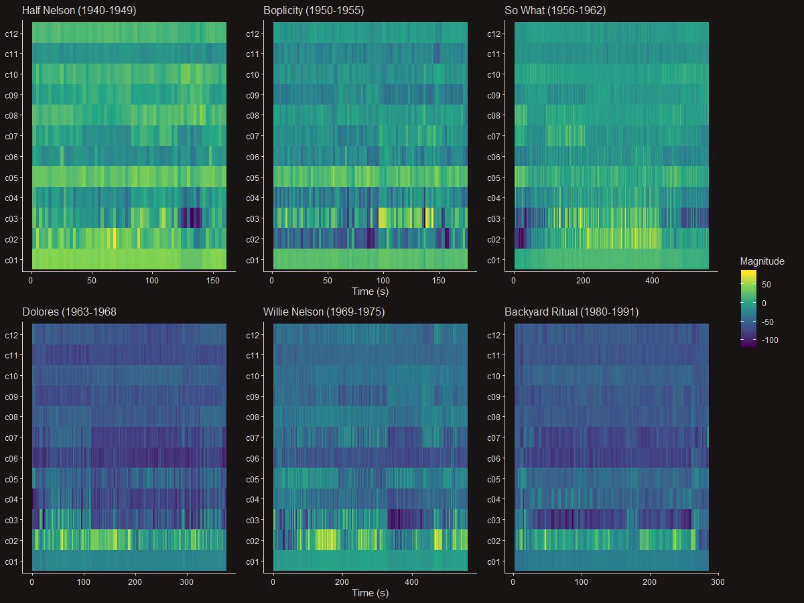
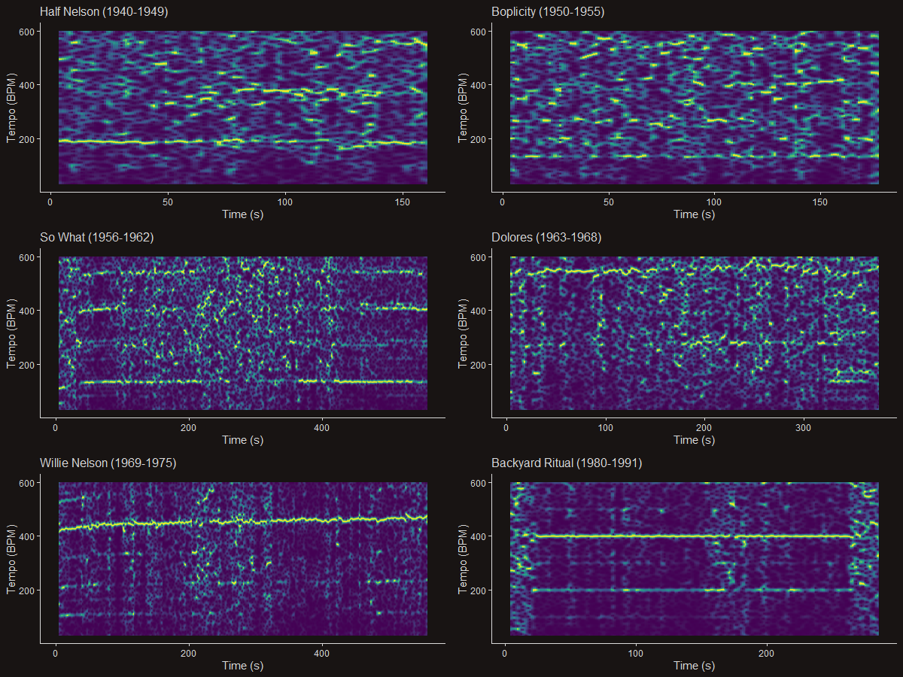
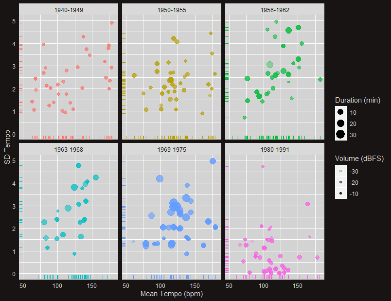
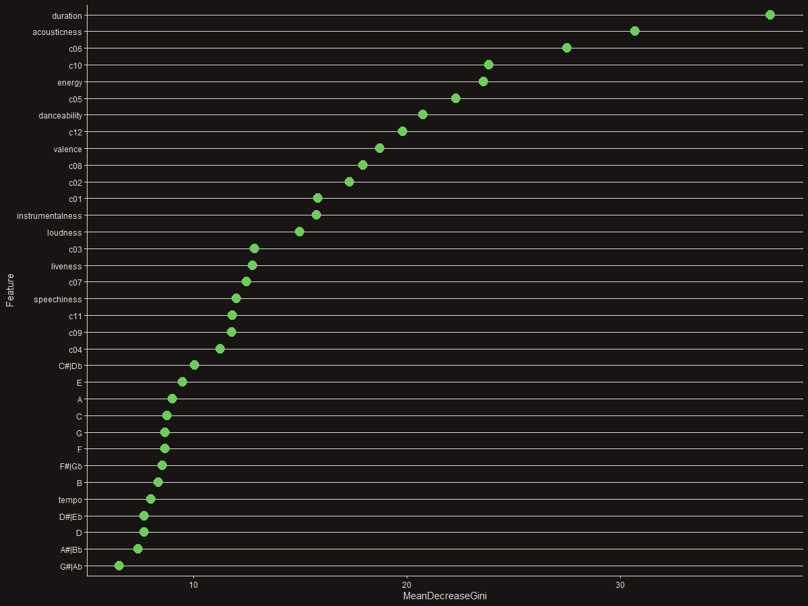
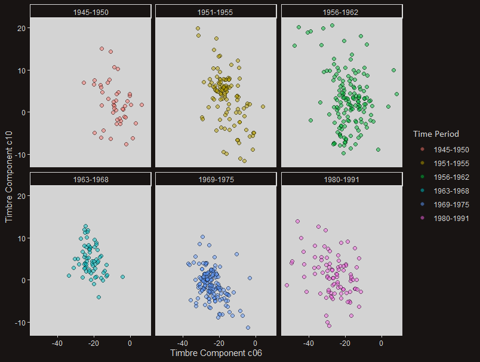

```{r setup}
# In order to use these packages, we need to install flexdashboard, plotly, and Cairo.
library(cowplot)
library(tidyverse)
library(plotly)
library(spotifyr)
library(Cairo)
library(gridExtra)
library(grid)
library(gtable)
library(compmus)
library(viridis)
source('spotify.R')
library(plyr)

#Clustering
library(tidymodels)
library(protoclust)
library(ggdendro)
library(heatmaply)
library(kknn)
library(C50)


Miles40 <- 
    get_playlist_audio_features('Wpleiter', '1v8oL4Clr0LliAh6HNK4C2')
miles40ies_cut <- as.data.frame(Miles40[,c(6:16, 36)])
miles40ies_cut$Time_Period <- "1944-1950"

MilesE50 <- 
    get_playlist_audio_features('Wpleiter', '3lv2u17pbcXIoNZZtP8wZ5')
miles50ies_cut <- as.data.frame(MilesE50[,c(6:16, 36)])
miles50ies_cut$Time_Period <- "1951-1955"


MilesModal <-
    get_playlist_audio_features('Wpleiter', '72abFzvkLC2lAakjbvl0iC') 
MilesModal_cut <- as.data.frame(MilesModal[,c(6:16, 36)])
MilesModal_cut$Time_Period <- "1956-1962"

MilesHerbie <- 
    get_playlist_audio_features('Wpleiter', '6xkz0JZB6vwlUrLzELBmyl')
MilesHerbie_Cut <- as.data.frame(MilesHerbie[,c(6:16, 36)])
MilesHerbie_Cut$Time_Period <- "1963-1968"

MilesFusion <- 
    get_playlist_audio_features('Wpleiter', '2vDm2J2p2NlcuOK367TDXB')
MilesFusion_cut <- as.data.frame(MilesFusion[,c(6:16, 36)])
MilesFusion_cut$Time_Period <- "1969-1975"


MilesFinal <- 
    get_playlist_audio_features('Wpleiter', '00PARgmS4ypOOQcOopQBoK')
MilesFinal_cut <- as.data.frame(MilesFinal[,c(6:16, 36)])
MilesFinal_cut$Time_Period <- "1980 - 1992"


miles_long <- rbind(miles40ies_cut, miles50ies_cut, MilesModal_cut, MilesHerbie_Cut, MilesFusion_cut, MilesFinal_cut)
miles_wide <- miles_long %>%
  gather("danceability", "energy", "speechiness", "acousticness", "instrumentalness", "liveness", "valence", key = Feature, value = Parameter)


theme_spotify <- theme(plot.background = element_rect(fill = '#181413', colour = '#181413'),
          legend.background = element_rect(fill = '#181413', colour = '#181413'),
          legend.text = element_text(colour = '#d9d9d9'),
          legend.title = element_text(colour = '#d9d9d9'),
          axis.title = element_text(colour = '#d9d9d9'),
          axis.text.x = element_text(colour = '#d9d9d9'),
          axis.text.y = element_text(colour = '#d9d9d9'),
          axis.ticks = element_line(colour = '#d9d9d9'),
          panel.background = element_rect(fill = '#181413'),
          axis.line = element_line(colour = '#d9d9d9')
          )


Spotify_SSM <- theme_classic() +
    theme(plot.background = element_rect(fill = '#181413', colour = '#181413'),
          legend.background = element_rect(fill = '#181413', colour = '#181413'),
          legend.text = element_text(colour = '#d9d9d9'),
          legend.title = element_text(colour = '#d9d9d9'),
          axis.title = element_text(colour = '#d9d9d9'),
          axis.text.x = element_text(colour = '#d9d9d9'),
          axis.text.y = element_text(colour = '#d9d9d9'),
          axis.ticks = element_line(colour = '#d9d9d9'),
          panel.background = element_rect(fill = '#181413'),
          plot.title = element_text(colour = '#d9d9d9'),
          axis.line = element_line(colour = '#d9d9d9')
          )
Spotify_palette <- c("#213263", "#523650", "#7b4a31", "#006451", "#ef1e31", "#8c1932", "#fd6437", "#ffcfd6", "#c57b54", "#529cf5", "#213263", "#006451")

#For z-scores, filter on is.numeric and then use scale to get z-scores

```


The Man with the Horn {.storyboard}
=============================================================


### The Musically shapeshifting genius that is Miles Davis {data-commentary-width=800}
{width=50%}


***

For my corpus I have decided to investigate the jazz trumpet player Miles Davis. Davis is known within the jazz and global community as a constant innovator and key figure of jazz music. His method for innovation was to constantly attract upcoming talents and stars within the upcoming current in jazz. He then instructed these youngsters with his own vision of jazz and this was reciprocated by the youngsters how provided him with their own new views.

In my corpus I will try to analyse Davis’ music by answering the following questions:

-	How did Davis’ music change over time, what are the constants in his music and what are the variables? 
- Are these changes visible using only Spotify Data
- Is the current selection of Miles' phases justified? Or might there be a better way to classify his music?


For selecting the phases, I have looked at the bandmembers Miles had played with during these years and made playlists in Spotify to group these phases. After finishing this crude selection, I could identify six phases:

<b>Early bebop/Charlie Parker phase: 1945-1950</b> <br>
During his formative years, Miles played with the bebop greats like Charlie Parker and Dizzy Gillespie, still mostly as a sideman, only playing solo's or accompanying the theme of the main player. Bebop is characterized by fast paced, harmonically nimble tunes that follow the standard jazz-structure of theme, solo and theme again.

<b>Hard Bop phase: 1950-1955 </b> <br>
After the 40ies, most jazz musicians started to get tired of the musical acrobatics that bebop demanded, and switched to a less complex style of jazz called hard-bop. These are mostly mid-tempo, mellow tunes that follow clear structure and allowed for more space in songs. This is the period in which Miles would collabarate with a lot of different musicians, and would be the birth of his "cool" sound.

<b>Modal phase: 1955-1962</b> <br>
Pushing the limits of hard-bop, Miles wanted to winnow harmonic complexity even further, opting to reduce chord changes to as little as possible, in exchange for focussing on a certain mode (minor and major are the main categories, but come in a lot of variations). This is his most popular period, in which he released the most succesful selling jazz album of all time: Kind of Blue. This period was not entirely all modal though, also containing his collaborations with Gil Evans.


<b>Acoustic experimental phase: 1963-1968</b> <br>
After "dumbing down" the music, Miles wanted to experiment again with harmonies, this time eschewing traditional harmony and pushing for less structured, more atonal music (heavily influenced by the harmonic departures of John Coltrane and the Free Jazz Movement). This is the period of his second great quintet, involving amongst others the youngsters Wayne Shorter and Herbie Hancock.

<b>Erratic Fusion Miles: 1969-1975</b> <br>
With electronic instruments bursting onto the scene, and with his bandmate Herbie Hancock being at the forefront of the revolution, Miles could not be left behind. He surrounded him with some of these frontrunners (Chick Corea amongst others) and went full electrical, except for his trumpet. This period is characterized by long jams in which multiple genres (mostly from the funk/soul and rock influence) were blended with his own sounds, to create an erratic melting pot.


<b>The Lost Period (1975-1980)</b> <br>
Not included in this corpus, in 1975 Miles left music behind following mental issues, drug addiction and overall fatigue. Having arguments with record companies and collaborations that fell through, Miles went on a 5 year hiatus to recenter himself. Perhaps something in the data would provide clues to this sudden departure.

<b>The Last Miles (1980-1991)</b> <br>
After returning, Miles continued on his innovative crusade, this time trying to incorporate the hip-hop and R&B influences of the time into his music. The music itself remained erratic to his death, but Miles showed willingness to revisit his older phases during this time.


### Miles transformations are visible in data from Spotify {data-commentary-width=500}

```{r echo=FALSE, message=FALSE, warning=FALSE}
#Slopegraph is not in my gg-package for some reason, trying something else:
library("slopegraph")

#Creating a unique matrix to fulfill the conditions of ggplot
Miles_slope <- matrix(0, 7, 6)
colnames(Miles_slope) <- unique(miles_wide$Time_Period)
rownames(Miles_slope) <- names(MilesFinal_cut[,c(1,2,6,7,8,9,10)])


#40ies
Miles_slope[1,1] <- mean(miles40ies_cut[,1])
Miles_slope[2,1] <- mean(miles40ies_cut[,2])
Miles_slope[3,1] <- mean(miles40ies_cut[,6])
Miles_slope[4,1] <- mean(miles40ies_cut[,7])
Miles_slope[5,1] <- mean(miles40ies_cut[,8])
Miles_slope[6,1] <- mean(miles40ies_cut[,9])
Miles_slope[7,1] <- mean(miles40ies_cut[,10])


#second
Miles_slope[1,2] <- mean(miles50ies_cut[,1])
Miles_slope[2,2] <- mean(miles50ies_cut[,2])
Miles_slope[3,2] <- mean(miles50ies_cut[,6])
Miles_slope[4,2] <- mean(miles50ies_cut[,7])
Miles_slope[5,2] <- mean(miles50ies_cut[,8])
Miles_slope[6,2] <- mean(miles50ies_cut[,9])
Miles_slope[7,2] <- mean(miles50ies_cut[,10])


#Third
Miles_slope[1,3] <- mean(MilesModal_cut[,1])
Miles_slope[2,3] <- mean(MilesModal_cut[,2])
Miles_slope[3,3] <- mean(MilesModal_cut[,6])
Miles_slope[4,3] <- mean(MilesModal_cut[,7])
Miles_slope[5,3] <- mean(MilesModal_cut[,8])
Miles_slope[6,3] <- mean(MilesModal_cut[,9])
Miles_slope[7,3] <- mean(MilesModal_cut[,10])


#4
Miles_slope[1,4] <- mean(MilesHerbie_Cut[,1])
Miles_slope[2,4] <- mean(MilesHerbie_Cut[,2])
Miles_slope[3,4] <- mean(MilesHerbie_Cut[,6])
Miles_slope[4,4] <- mean(MilesHerbie_Cut[,7])
Miles_slope[5,4] <- mean(MilesHerbie_Cut[,8])
Miles_slope[6,4] <- mean(MilesHerbie_Cut[,9])
Miles_slope[7,4] <- mean(MilesHerbie_Cut[,10])

#5
Miles_slope[1,5] <- mean(MilesFusion_cut[,1])
Miles_slope[2,5] <- mean(MilesFusion_cut[,2])
Miles_slope[3,5] <- mean(MilesFusion_cut[,6])
Miles_slope[4,5] <- mean(MilesFusion_cut[,7])
Miles_slope[5,5] <- mean(MilesFusion_cut[,8])
Miles_slope[6,5] <- mean(MilesFusion_cut[,9])
Miles_slope[7,5] <- mean(MilesFusion_cut[,10])


#6
Miles_slope[1,6] <- mean(MilesFinal_cut[,1])
Miles_slope[2,6] <- mean(MilesFinal_cut[,2])
Miles_slope[3,6] <- mean(MilesFinal_cut[,6])
Miles_slope[4,6] <- mean(MilesFinal_cut[,7])
Miles_slope[5,6] <- mean(MilesFinal_cut[,8])
Miles_slope[6,6] <- mean(MilesFinal_cut[,9])
Miles_slope[7,6] <- mean(MilesFinal_cut[,10])


Miles_slope <- as.data.frame(Miles_slope)

data <- Miles_slope
xlabels <- names(data)

palette <- c("#ffffff", "#E69F00", "#56B4E9", "#009E73", "#F0E442", "#0072B2", "#D55E00")
ggslopegraph(Miles_slope, offset.x = 1, main = "Mean Audio Features Of Miles Davis Per Period", xlim = c(-1,7), xlab = "Time Period", ylab = "Spotify Track Feature (0.00 - 1.00)",
  decimals = 2, col.lab = palette, col.lines = palette, col.num = palette, xlabels = c("'45-'50", "'51-'55", "'55-'63", "'63-'68", "'68-'75", "'80-'92"), labpos.right = 10, labpos.left = 0.7) + 
  theme(panel.grid =element_blank(), panel.background = element_blank()) +
    Spotify_SSM


```

***
From the outset, the  Very clearly visible from this slopegraph is the huge dip in Acousticness during his lifetime, other things that are very cleary visible is a general increase in energy, a maximum of liveness during his '63 to '68 phase and a decline in overall valence, which increased during his final years. Danceability stayed constant, with a big increase during his last years. 

The acousticness drop is easily interpretated, since he mostly switched to electrical instruments later on in life. A more difficult trend to interpret is the valence line. Valence is a measure of joyfulness in music, and as Miles became more erratic, his overall vibe became less joyful, after the hiatus it goes back to his original level, perhaps indicating that this hiatus motivated him to make more joyful music.

As valence dropped, energy rose, which is perhaps an odd combination, because you would assume that energetic music would be joyful music. The energy increase is explained by the increase in Miles increasing erraticness. Although he seems to have solved the balance of valence and energy in his final years. Even increasing danceability as well (perhaps hip-hop influences are responsible for this).


### Miles in terms of Valence, Danceability and energy {data-commentary-width=500}
```{r echo=FALSE, message=FALSE, warning=FALSE}

# miles_plot <- ggplot(miles_decades, aes(x = danceability, y = energy, col = Time_Period)) + 
#   geom_jitter()

ggplot(miles_long, aes(x = danceability, y = energy, col = valence)) + 
  geom_point(size = 2, alpha = 0.6) +
  facet_wrap(. ~ Time_Period) +
      geom_rug(size = 0.1) +
  scale_colour_gradient(low = "lightgreen", high = "darkgreen", na.value = NA) +
    theme(plot.background = element_rect(fill = '#181413', colour = '#181413'),
          legend.background = element_rect(fill = '#181413', colour = '#181413'),
          legend.text = element_text(colour = '#d9d9d9'),
          legend.title = element_text(colour = '#d9d9d9'),
          axis.title = element_text(colour = '#d9d9d9'),
          axis.text.x = element_text(colour = '#d9d9d9'),
          axis.text.y = element_text(colour = '#d9d9d9'),
          axis.ticks = element_line(colour = '#d9d9d9'),
          panel.background = element_rect(fill = '#181413'),
          )

          
  # Add 'fringes' to show data distribution.

```

***
A general trend is clearly visible during Miles lifetime, in which a predominantly low energy and high valence repertoire (1944 - 1954) gradually diversified to cover the entire of the spectrum in 1969-1975, in which he coverd the entire charts. His 1956-1962 years look like a very clear three-way correlations between valence, energy and danceability, as low energy and danceability correspond with low valence. In his 1963-1965 years he stayed constant in these parameters, not showing that much variation, although this seems hard to explain. The 1969-1975 years are all over the place, really showing his erraticness of that time, but also look to be dominated by a lot of very low valence tunes. In his final years there is a big trend towards danceability and high valence, perhaps he refound joy after the dark period?


### On the one! Miles in terms of tempo, key and mode {data-commentary-width=400}
```{r echo=FALSE, message=FALSE, warning=FALSE}

# miles_plot <- ggplot(miles_decades, aes(x = danceability, y = energy, col = Time_Period)) + 
#   geom_jitter()

tempo <- ggplot(miles_long, aes(x = Time_Period, y = tempo, fill = Time_Period), main = "Miles' Tempo's") + 
 geom_boxplot(show.legend = FALSE) + 
   xlab("Time Period") + ylab("Tempo in bpm") + 
  ggtitle("Miles' Tempo's") + 
  theme(text = element_text(),
        axis.text.x = element_text(size=7, angle = 90)) + 
  Spotify_SSM
  

mode <- as.factor(miles_long$mode)

mode <- revalue(mode, c("0"="Minor", "1"="Major"))

miles_long$mode <- mode
        
Modes <- ggplot(miles_long, aes(x = mode, fill = Time_Period), main = "Miles' Tempo's") + 
 geom_bar(show.legend = FALSE)  + ylab("Count") +
  ggtitle("Miles' Modes") + 
  facet_wrap(. ~ Time_Period) + 
  Spotify_SSM

key <- as.factor(miles_long$key)

key <- revalue(key, 
               c("0" = "C",
               "1" = "Db",
               "2" = "D",
               "3" = "Eb",
               "4" = "E",
               "5" = "F",
               "6" = "Gb",
               "7" = "G",
               "8" = "Ab",
               "9" = "A",
               "10" = "Bb",
               "11" = "B"))


miles_long$key <- key

keys <- ggplot(miles_long, aes(x = key, fill = key), main = "Miles' Tempo's") + 
 geom_bar(show.legend = FALSE)  + ylab("Count") +
  ggtitle("Miles' Keys") + 
  Spotify_SSM +
  facet_wrap(. ~ Time_Period) 

keys2 <- keys + theme(text = element_text(),
        axis.text.x = element_text(size=7)) + 
        Spotify_SSM
lay <- rbind(c(1,1,1,2,2),
             c(3,3,3,3,3))

grid.arrange(Modes, tempo, keys2, layout_matrix = lay)


```

***
<b>Miles' Modes </b> <br>
From the graph in the top left corner, it becomes apparent that Miles had a slight preference for the major key most of his life, although this effect is not substantive and could be due to errors in assigning modes in Spotify. The only really clear difference is during his erratic period, in which Major keys seem to dominate his songs, although from the slopegraph and the earlier valence graph it was visible that these were mostly low valence songs. 

<b>Miles' Tempo's </b> <br>
Overall, the tempo's seem to be quite constant during Miles' lifetime. Interesting is that the spread of the first phase is sloped towards the higher tempo's (indicating the influence of bebop) and his slowing down during the cool and hard-bop phases. Another interesting outlier is the black dot at the zero mark during his 1969-1975 phase, this is an introduction track of a live album so should be omitted. 

<b>Miles' Keys </b> <br>
In the early years there is a clear preference for the F-key in Miles' oeuvre. This makes sense, as a trumpet is generally tuned in Bb, with the most comfortable keys being F, Eb and Bb. The 1969-1975 years were mostly comprised of long jams, and the bandleader (Miles) would usually determine the key, which coincides with this comfort key being Bb in those years.

The keys E, Eb and Gb seem to be less favored by Miles, which is interesting because a lot of jazz is written in Eb. With musicians there is however a common tendency that if one favours a specific key (F in Miles' case), the keys surrounding that key are less favored, because they differ the most from the favourite key (other complimentary keys for F-minor are C-minor, Eb Minor, Ab-minor and complimentary for Major are A, C, D). It turns out that Miles follows this trend to avoid keys near to his favorite key.


### Comparing similar renditions of Summertime has only yielded inconclusive results {data-commentary-width=550}
```{r}
ST1959_audio_features <- get_track_audio_features('25H0Wd1ugPRXGM2LlpjVXM')
ST1991_AF <- get_track_audio_features('1c2Lw08YnZq71rUyrb2r8F')
ST1959 <- 
    get_tidy_audio_analysis('25H0Wd1ugPRXGM2LlpjVXM') %>% 
    select(segments) %>% unnest(segments) %>% 
    select(start, duration, timbre) %>%
    filter(start > 0, start < 72)
ST1991 <- 
    get_tidy_audio_analysis('1c2Lw08YnZq71rUyrb2r8F') %>% 
    select(segments) %>% unnest(segments) %>% 
    select(start, duration, timbre) %>%
    filter(start > 4, start < 72)
```


```{r}
compmus_long_distance(
    ST1959 %>% mutate(timbres = map(timbre, compmus_normalise, 'manhattan')),
    ST1991 %>% mutate(timbres = map(timbre, compmus_normalise, 'manhattan')),
    feature = timbres,
    method = 'euclidean') %>% 
    ggplot(
        aes(
            x = xstart + xduration / 2, 
            width = xduration,
            y = ystart + yduration / 2,
            height = yduration,
            fill = d,
            main = "Miles Davis Summertime Comparison (1959 & 1991)")) + 
    geom_tile() +
    scale_fill_viridis_c(option = 'D', guide = 'none') +
    labs(x = 'Summertime 1959', y = 'Summertime 1991') +
    Spotify_SSM


```


***
Using Dynamical Time-warping, I have compared two renditions of the popular song Summertime (Gershwin). One is recorded on the album Porgy & Bess by Miles in 1959 and arranged/produced by Gil Evans. The other is a 1991 (right before his death) rendition which uses the same arrangement and the same key. The differences between these tracks are that 1991 version is significantly faster (107 in 1959 and 132 in 1991).

For the comparison I only used the theme, as these are similar in arrangement and similar in melody, although very much not equal, since theme's can vary wildly from eachother in jazz. For this reason, I wanted to compare timbres and not chroma features of the two songs, but to no avail. I used the manhattan normalisation and the euclidean distance to compare songs. But the fact that one was live and the other was a studio recording apparently made comparison very hard.

When trying to compare the songs, A faint diagonal line can be made out around the middle of the graph with parallel lines above and under it, that wobbles a bit untill it disappears again around the 60 second mark. The theme repeats once, so this is visible. You would expect to see the line sloping upwards towards to end, showing that the 1991 version is considerably faster, but this is not visible. The checkerboard pattern does show some promising results in comparing similarities and shows that overall the timbres remain the same. Generally speaking, this would mostly be due to the very similar ensemble timbres. Miles sound was less strong in his later years.

Check out the 1991 Summertime rendition (same recording as on the album)! <br> <br>
<audio controls>
  <source src="Summertime - Miles Davis with Quincy Jones.mp3" type="audio/mp3">
</audio>

Have a listen to the 1959 rendition: <br><br>
<audio controls>
  <source src="Miles Davis - Summertime.mp3" type="audio/mp3">
</audio>

<i>In conclusion of this page: Miles transformations are very cleary visible in terms of valence, danceability, acousticness and energy. The tempo's remained mostly the same, but Miles had a specific preference for the key F during his lifetime. Since we now have a global overview of his oeuvre, it is time to check out the most typical and atypical songs of each phase. Click on the tab "Typical Miles" in the navigation bar to continue. </i>


Typical Miles {.storyboard}
===============================================

### Selecting Miles' most typical tracks {data-commentary-width=800}


```{r}


viridis_palette <- viridis(12)

Typical_miles <- get_playlist_audio_features('Wpleiter', '586wDQmEni6bYtey5QaId3')
Typical_miles_cut <- as.data.frame(Typical_miles[,c(6:16, 36)])

Typical_miles_cut[5,12] <- "Willie Nelson"
Typical_miles_cut <- Typical_miles_cut[,-c(6,8,9)]

Typical_miles_cut$track.name <- factor(Typical_miles_cut$track.name, levels = c("Half Nelson", "Boplicity", "So What", "Dolores", "Willie Nelson", "Backyard Ritual"
))

Typical_wide <- Typical_miles_cut %>%
  gather("danceability", "energy", "acousticness", "valence", key = Feature, value = Parameter)


Features <- ggplot(Typical_wide, aes(x = Feature, y = Parameter, fill = Feature)) + 
  geom_col() +
  Spotify_SSM + 
  facet_wrap(.~ track.name) + 
   theme(axis.title.x=element_blank(),
        axis.text.x=element_blank(),
        axis.ticks.x=element_blank(),
        panel.grid.major.y = element_line(colour = "#d9d9d9")) +
  scale_fill_manual(values = viridis_palette[7:10])


Tempi <- ggplot(Typical_miles_cut, aes(x = track.name, y = tempo, fill = track.name)) +
  geom_col() + 
  Spotify_SSM +
   theme(axis.title.x=element_blank(),
        axis.text.x=element_blank(),) + 
  ylab("Tempo in bpm") +
  labs(fill = "Song") +
  scale_y_continuous(limits = c(0, 150), breaks = seq(0,150, by = 15)) +
  scale_fill_manual(values = viridis_palette[5:10])


grid.arrange(Features, Tempi)


  
  


```


***


To select Miles' most typical tracks, I have made composite standardized z-scores based on acousticness, danceability, valence, energy and tempo. This allows me to filter out the most typical and atypical songs of each time period. The following is a list of typical songs (z < 0.1)

Most typical songs per time (based on tempo, valence, danceability, acousticness and energy)

1940-1949: Half Nelson

1950-1959: Boplicity

1956-1962: ‘Round Midnight

1963-1968: So What	

1969-1975: Willie Nelson - Live at Fillmore East, New York, NY - June 20, 1970

1980-1991: Backyard Ritual

I've compiled these songs in a spotify playlist, and plotted their general characteristics. Check it out!

<iframe src="https://open.spotify.com/embed/playlist/586wDQmEni6bYtey5QaId3" width="300" height="380" frameborder="0" allowtransparency="true" allow="encrypted-media"></iframe>


### Analysing typical song structures shows both similarites and differences between phases {data-commentary-width=500}
```{r}
Half_nelson <- 
    get_tidy_audio_analysis('1Zg26AmRfKDZR2W4MLjO91') %>% 
    compmus_align(bars, segments) %>% 
    select(bars) %>% unnest(bars) %>% 
    mutate(
        pitches = 
            map(segments, 
                compmus_summarise, pitches, 
                method = 'rms', norm = 'aitchison')) %>% 
    mutate(
        timbre = 
            map(segments, 
                compmus_summarise, timbre, 
                method = 'mean'))
```


```{r}
HN_plot <- Half_nelson %>% 
    compmus_self_similarity(timbre, 'cosine') %>% 
    ggplot(
        aes(
            x = xstart + xduration / 2, 
            width = xduration,
            y = ystart + yduration / 2,
            height = yduration,
            fill = d)) + 
    Spotify_SSM +
    geom_tile() +
    coord_fixed() +
    scale_fill_viridis_c(option = 'D', guide = 'none') +
    labs(x = '', y = '')+
    theme(plot.title = element_text(size=7)) +
    ggtitle("Half Nelson (1940-1949)")


```


```{r}
Bopli <- 
    get_tidy_audio_analysis('0Wz6DLq8NBoi1viEqrdH9B') %>% 
    compmus_align(bars, segments) %>% 
    select(bars) %>% unnest(bars) %>% 
    mutate(
        pitches = 
            map(segments, 
                compmus_summarise, pitches, 
                method = 'rms', norm = 'aitchison')) %>% 
    mutate(
        timbre = 
            map(segments, 
                compmus_summarise, timbre, 
                method = 'mean'))
```


```{r}
Bop_plot <- Bopli %>% 
    compmus_self_similarity(timbre, 'cosine') %>% 
    ggplot(
        aes(
            x = xstart + xduration / 2, 
            width = xduration,
            y = ystart + yduration / 2,
            height = yduration,
            fill = d)) + 
    Spotify_SSM + 
    geom_tile() +
    coord_fixed() +
    scale_fill_viridis_c(option = 'D', guide = 'none') +
    labs(x = '', y = '')+
    theme(plot.title = element_text(size=7)) +
    ggtitle("Boplicity (1950-1955)")

```


```{r}
SW <- 
    get_tidy_audio_analysis('4vLYewWIvqHfKtJDk8c8tq') %>% 
    compmus_align(bars, segments) %>% 
    select(bars) %>% unnest(bars) %>% 
    mutate(
        pitches = 
            map(segments, 
                compmus_summarise, pitches, 
                method = 'rms', norm = 'aitchison')) %>% 
    mutate(
        timbre = 
            map(segments, 
                compmus_summarise, timbre, 
                method = 'mean'))
```


```{r}
SW_plot <- SW %>% 
    compmus_self_similarity(timbre, 'euclidean') %>% 
    ggplot(
        aes(
            x = xstart + xduration / 2, 
            width = xduration,
            y = ystart + yduration / 2,
            height = yduration,
            fill = d)) + 
    Spotify_SSM + 
    geom_tile() +
    coord_fixed() +
    scale_fill_viridis_c(option = 'D', guide = 'none') +
    labs(x = '', y = '') +
    theme(plot.title = element_text(size=7)) +
    ggtitle("So What (1956-1962)")
    
  

```


```{r}
Dolores <- 
    get_tidy_audio_analysis('15efZycxeJGxFeFw2f8ysQ') %>% 
    compmus_align(bars, segments) %>% 
    select(bars) %>% unnest(bars) %>% 
    mutate(
        pitches = 
            map(segments, 
                compmus_summarise, pitches, 
                method = 'rms', norm = 'aitchison')) %>% 
    mutate(
        timbre = 
            map(segments, 
                compmus_summarise, timbre, 
                method = 'mean'))
```


```{r}
Dol_Plot <- Dolores %>% 
    compmus_self_similarity(timbre, 'cosine') %>% 
    ggplot(
        aes(
            x = xstart + xduration / 2, 
            width = xduration,
            y = ystart + yduration / 2,
            height = yduration,
            fill = d)) + 
    Spotify_SSM + 
    geom_tile() +
    coord_fixed() +
    scale_fill_viridis_c(option = 'D', guide = 'none') +
    labs(x = '', y = '')+
    ggtitle("Dolores (1963-1968)") +
    theme(plot.title = element_text(size=7))


```


```{r}
WN <- 
    get_tidy_audio_analysis('5mJseFWjLDEdkme7n5FjT7') %>% 
    compmus_align(bars, segments) %>% 
    select(bars) %>% unnest(bars) %>% 
    mutate(
        pitches = 
            map(segments, 
                compmus_summarise, pitches, 
                method = 'rms', norm = 'aitchison')) %>% 
    mutate(
        timbre = 
            map(segments, 
                compmus_summarise, timbre, 
                method = 'mean'))
```


```{r}
WN_plot <- WN %>% 
    compmus_self_similarity(timbre, 'cosine') %>% 
    ggplot(
        aes(
            x = xstart + xduration / 2, 
            width = xduration,
            y = ystart + yduration / 2,
            height = yduration,
            fill = d)) + 
    geom_tile() +
    Spotify_SSM + 
    coord_fixed() +
    scale_fill_viridis_c(option = 'D', guide = 'none') +
    theme(plot.title = element_text(size=7)) +
    labs(x = '', y = '')+
    ggtitle("Willie Nelson (1969-1975)")

```


```{r}
BYR <- 
    get_tidy_audio_analysis('5JBrDXF0NcUFN0rYq642xs') %>% 
    compmus_align(bars, segments) %>% 
    select(bars) %>% unnest(bars) %>% 
    mutate(
        pitches = 
            map(segments, 
                compmus_summarise, pitches, 
                method = 'rms', norm = 'aitchison')) %>% 
    mutate(
        timbre = 
            map(segments, 
                compmus_summarise, timbre, 
                method = 'mean'))

```


```{r}
BYR_plot <- BYR %>% 
    compmus_self_similarity(timbre, 'cosine') %>% 
    ggplot(
        aes(
            x = xstart + xduration / 2, 
            width = xduration,
            y = ystart + yduration / 2,
            height = yduration,
            fill = d)) + 
    geom_tile() +
    Spotify_SSM + 
    coord_fixed() +
    scale_fill_viridis_c(option = 'D', guide = 'none') +
    theme(plot.title = element_text(size=7)) +
    labs(x = '', y = '') +
    ggtitle("Backyard Ritual (1980-1991)") 

```


```{r include=FALSE}
g <- grid.arrange(HN_plot, Bop_plot, SW_plot, Dol_Plot, WN_plot, BYR_plot, ncol = 3, nrow = 2)
```


```{r}
g2 <- cowplot::ggdraw(g) + 
  theme(plot.background = element_rect(fill="#181413", colour = '#121212'))
plot(g2)
```

***

The self-similarity matrices (SSMs) shown here are based on timbre, with cosine distance and mean summary statistic. I've chose timbre of croma, because pitches tend to vary wildly in jazz, since more complex chords and accompaniment are usually present. Timbre is more of a constant feature and is hence better to examine structure.

Looking through the matrices, it is clear that in the first three phases the timbres remain mostly similar throughout the songs, with the squares of the checkerboard-pattern not showing major changes (green colours) and being mostly dark compared to other squares. For Half Nelson, there is one big change around the 120 second mark, which is the point where Miles starts to play his solo (prior to that Charlie Parker and Miles were playing together, with Charlie taking the first solo). Boplicity shows a similar pattern, in which solo's are highlighted. Dolores also follows this pattern. 

So What is an interesting SSM because it has big green lines instead of the clear square pattern. So What is a track categorized by a lot of call & response, in which first one instrument plays and the others respond afterwards. This could be the reason for the lines appearing as they do. Furthermore, Miles plays sparsely, not stringing lines together, but rather making short statements with a lot of space between them, this is also a reason why the matrix shows these sharp lines instead of square-patterns.

Willie Nelson shows the largest amount of big timbrechanges in the song, but is still quite structured in timbre-organization, indicating clear solo-preferences. The squares surrounding that show a lot of difference though, indicating that this song is more complex then the other ones. This is in contrast with Backyard Ritual, in which a bass-line repeats over and over with a baseline by Marcus Miller. The only real differences are the intro, outro and when the Saxophone takes a short solo around the 180 mark.

Overall, the songs are quite differently structured from eachother, showing differences in Miles approach during his phases. These are of course not fully representative of his phases, but provide a good summary and indication. Next, lets check with cepstrograms how the timbres are distributed.


### Miles' Timbres started off uninterpretable {data-commentary-width=500}

```{r}
library(ggpubr)

HN_cep <- Half_nelson %>% 
    compmus_gather_timbre %>% 
    ggplot(
        aes(
            x = start + duration / 2, 
            width = duration, 
            y = basis, 
            fill = value)) + 
    geom_tile(show.legend = FALSE) +
    labs(x = '', y = NULL, fill = 'Magnitude') +
    scale_fill_viridis_c(option = 'D') +
    Spotify_SSM + 
    theme(plot.title = element_text(size=12)) +
    ggtitle("Half Nelson (1940-1949)") 


HN_cep2 <- Half_nelson %>% 
    compmus_gather_timbre %>% 
    ggplot(
        aes(
            x = start + duration / 2, 
            width = duration, 
            y = basis, 
            fill = value)) + 
    geom_tile() +
    Spotify_SSM + 
    labs(x = '', y = NULL, fill = 'Magnitude') +
    scale_fill_viridis_c(option = 'D') +
    theme(plot.title = element_text(size=12)) +
    ggtitle("Half Nelson (1940-1949)")

```

```{r}
Bop_cep <- Bopli %>% 
    compmus_gather_timbre %>% 
    ggplot(
        aes(
            x = start + duration / 2, 
            width = duration, 
            y = basis, 
            fill = value)) + 
    Spotify_SSM + 
    geom_tile(show.legend = FALSE) +
    labs(x = 'Time (s)', y = NULL, fill = 'Magnitude') +
    scale_fill_viridis_c(option = 'D') +
    theme(plot.title = element_text(size=12)) +
    ggtitle("Boplicity (1950-1955)")

```


```{r}
SW_cep <- SW %>% 
    compmus_gather_timbre %>% 
    ggplot(
        aes(
            x = start + duration / 2, 
            width = duration, 
            y = basis, 
            fill = value)) + 
    Spotify_SSM + 
    geom_tile(show.legend = FALSE) +
    labs(x = '', y = NULL, fill = 'Magnitude') +
    scale_fill_viridis_c(option = 'D') +
    theme(plot.title = element_text(size=12)) +
    ggtitle("So What (1956-1962)") 
```


```{r}
Dol_cep <- Dolores %>% 
    compmus_gather_timbre %>% 
    ggplot(
        aes(
            x = start + duration / 2, 
            width = duration, 
            y = basis, 
            fill = value)) + 
    geom_tile(show.legend = FALSE) +
    Spotify_SSM + 
    labs(x = '', y = NULL, fill = 'Magnitude') +
    scale_fill_viridis_c(option = 'D') +
    ggtitle("Dolores (1963-1968") +
    theme(plot.title = element_text(size=12))

```


```{r}
WN_cep <- WN %>% 
    compmus_gather_timbre %>% 
    ggplot(
        aes(
            x = start + duration / 2, 
            width = duration, 
            y = basis, 
            fill = value)) + 
    Spotify_SSM + 
    geom_tile(show.legend = FALSE) +
    labs(x = 'Time (s)', y = NULL) +
    scale_fill_viridis_c(option = 'D') +
   ggtitle("Willie Nelson (1969-1975)") + 
      theme(plot.title = element_text(size=12))
   


```


```{r}
BYR_cep <- BYR %>% 
    compmus_gather_timbre %>% 
    ggplot(
        aes(
            x = start + duration / 2, 
            width = duration, 
            y = basis, 
            fill = value)) + 
    Spotify_SSM + 
    geom_tile(show.legend = FALSE) +
    labs(x = '', y = NULL, fill = 'Magnitude') +
    scale_fill_viridis_c(option = 'D') +
    ggtitle("Backyard Ritual (1980-1991)") + 
   theme(plot.title = element_text(size=12))

legend <- get_legend(HN_cep2)
legend <- as_ggplot(legend)


lay <- rbind(c(1,1,1,2,2,2,3,3,3,7),
             c(4,4,4,5,5,5,6,6,6,7))

```



***

When looking at the Cepstrograms, the following two things become apparent:

- The first 3 phases show a lot more activity on all bands of timbre, indicating more timbre diversity.
- The timbregrams seem to decrease in overall activity during his lifetime.


The Half Nelson chart looks almost completely uninterpretable, except for the dip in activity of band c03 at the 120 mark, which is when the drums stop and a bass solo is played. The recording itself however is plagued by lots of background noise, since recording techniques weren't as great as they are now back then. This is solved during boplicity more or less, but this composition has a lot of instruments (6 piece brass band and a rhythm section). Short solo's are taken in Boplicity, but they are not easily identifiable in the cepstrogram. So What starts with drums and piano, and c02 is absent during this intro, indicating perhaps that this band is covered by the drums. C05 and C08 might be candidates for parts of the bass and the drums. 

With the bottom three panels, a clearer structure becomes apparent, in which there is a subdivision of instruments. Dolores has quite a strict solo-program, as does Willy Nelson.


It appears once again that Miles followed jazz tradition, in which usually 1 soloist is playing, accompanied by a rhythm section. Rhythm is the last component that we'll check before moving on to justifying the phases. 


### Over the Barline and Beyond: the rhythmic differences of Miles compared to his brass Sidemen {data-commentary-width=500}



***
First let me list the self-measured and Spotify tempo's of all the pieces:

- Half Nelson: 192 bpm, Spotify: 94,5 bpm

- Boplicity: 135 bpm, Spotify: 135.6 bpm

- So What: 130 bpm, Spotify: 136.3 bpm

- Dolores: 280 bpm, Spotify: 138.442 bpm

- Willie Nelson: 112 bpm (but speeds up rapidly)

- Backyard Ritual: 100 bpm, Spotify: 100 bpm


Judging by the tempograms, it seems like only Half Nelson was dead on, this was probably because of the walking bass and the fact that the drums also stayed fairly constant. This kept the novelty constant which made it easier to determine tempo. For Boplicity the line around 135 bpm is also quite discernable, once again due to the drums being less busy and the bass providing a solid backbone.

For So What the intro is all over the place, which makes sense as this was played rubato. After that it settles in around 130 bpm, which is also a visible line in the tempogram, with triple time also being very clear (390 bpm). It gets a bit off track during John Coltrane's saxophone solo however, which is quite funny when listening to the song, because it is very clear Coltrane dances around the rhythm a lot, whereas Miles stays a lot closer to the pulse. These influences are seen in Dolores as well, in which the best discernable line is around 560 bpm, this makes a lot of sense since Miles solo's almost exclusively consist of 8th notes and Wayne Shorter's solo does this as well. On top of that the drums feature a lot more fills than earlier years. 

Willie Nelson and Backyard Ritual are most clear in their tempograms, with Willie Nelson having a clear line around 410 bpm. This is weird, since the song speeds up and slows down a lot (the line does have some upward curve to it). I would've expected the lines to be less pronounced, but did not except the quadruple mark do be this strong. The drums do subdivide the piece into 16th notes, and do play a lot of these notes in fills and such, so perhaps that is the reason why that line is so prominent. Backyard Ritual has the straightest line of all tempograms, which is logical since it is using a drumcomputer as backing track. Once again the subdivision of the drums is in 16th notes, which makes the 400 bpm mark the logical winner in the tempogram.

The takeaway from all this is that Miles is not as rhythmically adventurous a soloist as Coltrane was. It would've been interesting to check out the novelty functions as well to get confirmation on my hypotheses about subdivisions of beats, but I feel like that would make the corpus too long. 

When comparing tempograms with Spotify's decisions, it appears that Spotify got close to the right bpm most of time (which means their algorithm can detect differences between beats and subdivisions), except for Dolores and Half Nelson, which Spotify measured to be around half-time, whereas the bass clearly walks twice as fast in that piece.

Miles' foray into drumcomputers and hiphop is quite characteristic of his later years, and it seems to translate as well in his most typical track. Furthermore, the franticness building in his 1663-1975 years is quite obvious from the building tempo's and heavy typical pieces.


### Zooming out: Summarizing low level playlist features{data-commentary-width=500}



***
After analysing the typical tracks, it is time to check out if they hold any validity when analysing more songs per time period. Before interpretating the graph, here is a table with summaries on loudness, tempo and duration. I've tried to compare timbres across playlist, but this yielded no big differences between time-periods


| Time Period     | Feature       | Mean      | SD          |
|-----------------|---------------|-----------|-------------|
| 1940-1949       | Tempo         | 121 bpm   | 37.4 bpm    |
|                 | Duration      | 177 s     | 17.6 s      |
|                 | Loudness      | -11.45    | 2.0         |
| 1950-1955       | Tempo         | 119 bpm   | 31.7 bpm    |
|                 | Duration      | 273 s     | 111.4 s     |
|                 | Loudness      | -12.82    | 3.0         |
| 1956-1962       | Tempo         | 113 bpm   | 30.0 bpm    |
|                 | Duration      | 420 s     | 220 s       |
|                 | Loudness      | -15.1     | 4.35        |
| 1963-1968       | Tempo         | 121 bpm   | 37.4 bpm    |
|                 | Duration      | 471 s     | 213 s       |
|                 | Loudness      | -13.2     | 2.6         |
| 1969-1975       | Tempo         | 121 bpm   | 31.7 bpm    |
|                 | Duration      | 850 s     | 497.9 s     |
|                 | Loudness      | -11.2     | 3.9         |
| 1980-1991       | Tempo         | 111 bpm   | 26.1 bpm    |
|                 | Duration      | 261 s     | 90 s        |
|                 | Loudness      | -12.6     | 5.40        |


For the graph I have looked at only the first 50 songs of each phase, since computing otherwise provided errors and took very long. 

Looking at the graph and the table, it becomes apparent that the song duration steadily increases over the phases, eventually dropping back in his last phase. A big increase is in his 1969-1975 years, with a whopping 850 second average duration (although standard deviation is substantial) 

The standard deviations of the graph in tempo in the first five phases are evenly dispersed between 2 and 5 bpm. Miles' music was all played live during this time and bands tend to deviate between tempo's compared to drumcomputers and such. This becomes visible in his last phase, in which most of the tempo SDs are concentrated between 0 and 1. 


Overall it can be said that the typical Miles' songs accurately capture characteristics of the phases themselves.


<i>This was the analysis of Miles' most typical pieces according to Spotify and my own selection of phases. Are these phases justified however? Click on the tab Predicting Phases. </i>


Predicting Phases {.storyboard}
===============================================


### How predictable are Miles' Phases? {data-commentary-width=800}


***

In the beginning of my corpus I decided to split Miles' entire oeuvre into 6 distinct categories, based on the kind of music he was making at the time and the sidemen he surrounded him with (unfortunately very little sidewomen), but I never checked whether the division into these categories was valid. It might be that another division of Miles' periods based on Spotify data would fit better, thereby threatening the constent validity of my corpus. With the arrival of prediction techniques in this course, I now have the tools to check if an algorithm can tell these different time periods apart from each other as well as I can. If that is the case, it provides proof that my current subset of phases is justified. Cluster analysis can provide further alternatives in splitting up the data, so perhaps that could either confirm or refute my hypothesis. Lets start with the predictive models.

After fiddling around with the KNN-means method and the random forest method, I saw that the random forest model performed slightly better overall, so that became the model of choice, the tables on the left represent the unstandardized results and the standardized results in the form of percentages. The overall predictive succes of the model was 78%, which is promising.

First of all, there is a very clear distinction between early miles (1945-1962), transition miles (1963-1968) and late miles (1969-1991), as virtually none of the earlier songs get wrongfully assigned to later periods and vice versa. The transition period is called this because this is a period where Miles' started distancing himself from traditional harmony and general music theory that evolved from the swing, bop and modal age, as he himself was influenced by the free jazz movement from Ornette Coleman, Cecil Taylor and Eric Dolphy amongst others. The Fusion (69-75) and the Modal (1956-1962) periods are the most distinct of all periods in this table, with very high accuracy. But what were the strongest predictors in this model?

### How predictable are Miles' Phases? {data-commentary-width=500}




*** 

This graphs shows the importance of each predictor when building the model, all predictors are currently visible and can be roughly divided into three groups: 
- Spotify general features (Acousticness, Valence, Danceability etc.)
- Timbre features (c01 - c12)
- Key features (C to B)

The predictors are ordered from low to high on their importance for predicting the time periods by their MeanDecreaseGini values, which is an indicator of predictor importance when using Random Forest Model. A higher score on MeanDecreaseGini translates to a higher importance for that predictor.

The predictor duration comes out as the most important predictor of this model, which makes a lot of sense given the last section of my corpus, which showed a lot of differences in duration per time period. The reasons for this are as follows: recording techniques in the 40ies and 50ies were generally still not perfect and people did not have the means and the tape to record long songs. This all got better during the 50ies however, in which Miles started recording his first 10 minute plus songs (the song All Blues from 1959 for instance is 11 minutes). So apart from Miles' his own preferences for duration, he was also very heavily limited by the techniques at the time. Still, the duration of his songs gradually increased and culminated during his fusion period (1969-1975), in which jams could last for over 30 minutes on some instances. 


The second most important predictor is acousticness, which already was apparent from the slopegraph in the intro section. The acousticness heavily declined over the Miles' lifespan, which makes it a prime predictor for the model. Miles was a constant innovator, and the increasing popularity of electric guitars, piano's, basses and synthesizer in the mainstream also affected him. After 1969, most of his bandmates played electrical instruments. He himself however, never strayed far from his iconic muted trumpet sound.

After these predictors the timbre feature c06 is also quite important as a predictor, which is strange since I've not seen any indication that this might be the case. On the next panel I will provide a short detour dedicated to this part.

At the bottom are tempo and the keys, which makes a lot of sense as well. Jazz-culture is jam-culture, each musician is brought up on jam-sessions, in which any musician could call on any tune in any key (and at any tempo). This is reflected in Miles' music as well, I could perhaps visualize the distribution of tempi and keys to further substantiate this point.

During the building of my model, I culled several predictors, of which almost all keys, the tempo and speechiness variable (since most of the music is instrumental). Furthermore, I incorporated interactions in my random forest model based on the slopegraph in the other panel. I created interactions between energy/acousticness and instrumentalness/energy. All modifications added about 7% to the prediction accuracy, and a random forest performed about 10% better on average than a Knn-means model.


### MFCC 06 and 10 are great predictors, but why? {data-commentary-width=500}



***

In the panel I have plotted the values of MFCC 06 and 10. The MFCC (Mel-Frequency Cepstral Coefficient) did come by earlier when discussing timbres, but except for a general decrease in activity in the higher "less important" MFCCs, I did not spot anything unusual. I was wrong. Looking at this panel, one can discern somewhat of a trend where the first phase shows a lot of activity on the c06 MFCC, with the next two phases showing increasing activity in the c10 MFCC as well. The last two phases drastically differ from the other phases, as they show fewer presence of both c10 and c06. 

As far as interpretation goes, MFCC can get quite tricky. In general they represent components of the overall timbre of a piece, but it by no means translates to a specific instrument in this instant. The biggest transition during Miles' switch from acoustic to electrical (starting in 1969), might be the cause of the aforementioned pattern. During this time, the piano and bass switched from acoustic to electric, with some electric guitar and changes in melody instruments (soprano sax and wind-instruments), only the drums and trumpet sound remained constant. The first four phases were mostly piano, bass, saxophone, trumpet and drums, the last two phases were mostly electrical instruments and the final phase also had a lot of samples and drum-computers. The overall changes in timbre seen here, might relate to the overall drop in acousticness (also a big predictor), but as mentioned before this is not easily derived from MFCCs.

