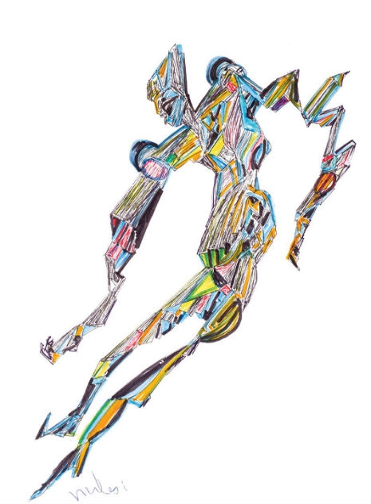

```{r setup}
# In order to use these packages, we need to install flexdashboard, plotly, and Cairo.
library(tidyverse)
library(plotly)
library(spotifyr)
library(Cairo)
library(gridExtra)
library(grid)
library(gtable)
library(compmus)
library(viridis)
source('spotify.R')
miles_davis <- get_artist_audio_features("Miles Davis")
```


### Miles Davis most popular track is very structured. {data-commentary-width=400}

```{r}
BiG <- 
    get_tidy_audio_analysis('0aWMVrwxPNYkKmFthzmpRi') %>% 
    compmus_align(bars, segments) %>% 
    select(bars) %>% unnest(bars) %>% 
    mutate(
        pitches = 
            map(segments, 
                compmus_summarise, pitches, 
                method = 'rms', norm = 'euclidean')) %>% 
    mutate(
        timbre = 
            map(segments, 
                compmus_summarise, timbre, 
                method = 'mean'))
```


```{r}
BiG_structure <- matrix(0, 1, 7)
colnames(BiG_structure) <- c('Intro (piano, Bill Evans)', 
                             "Theme and solo Miles (trumpet)", 
                             "Solo Bill Evans (piano)", 
                             "Solo John Coltrane (Tenor Saxophone)", 
                             "2nd Solo Bill Evans",
                             "Solo Miles and final theme",
                             "Outro (piano, Bill Evans)")
BiG_structure[1,] <- c("0 - 20", "20 - 108", "108 - 146", "146 - 190", "190 - 212", "212 - 296", '296 - 337')
BiG_structure <- as.data.frame(t(BiG_structure))
colnames(BiG_structure) <- "Time Stamp"

```


```{r}
BiG_plot <- BiG %>% 
    compmus_self_similarity(timbre, 'cosine') %>% 
    ggplot(
        aes(
            x = xstart + xduration / 2, 
            width = xduration,
            y = ystart + yduration / 2,
            height = yduration,
            fill = d)) + 
    geom_tile() +
    coord_fixed() +
    scale_fill_viridis_c(option = 'E', guide = 'none') +
    theme_classic() +
    labs(x = '', y = '')


  tt3 <- ttheme_minimal(
  core=list(bg_params = list(fill = viridis(7, alpha = 0.5) , col=NA),
            fg_params=list(fontface=1)),
  colhead=list(fg_params=list(col="navyblue", fontface=1L, cex = 1)),
  rowhead=list(fg_params=list(col="navyblue", fontface=2L, cex = 1)),
  base_size = 5)
  


BiG_Grob <- tableGrob(BiG_structure, theme=tt3)

grid.arrange(BiG_plot, BiG_Grob, widths = c(2,1,1))

```

***
Looking at the self-similarity matrix, the structure can very clearly be derived by the pattern. I've added timestamps in the table to show the individual sections of the song and they align perfectly. The setup is a quintet, with trumpet, piano and saxophone taking solo's and the rhythm section (piano, bass and drums) accompanying throughout the piece. The reason that this self-similarity matrix works so well is because only one instrument is solo-ing and the accompaniment stays the same. This makes the track very well structured and therefore easy to analyse with SS-matrices.

Have a listen to the song: <br><br>
<audio controls>
  <source src="Blue in Green by. Miles Davis.mp3" type="audio/mp3">
</audio>


### Comparing similar renditions of Summertime has only yielded inconclusive results so far {data-commentary-width=550}
```{r}
ST1959_audio_features <- get_track_audio_features('25H0Wd1ugPRXGM2LlpjVXM')
ST1991_AF <- get_track_audio_features('1c2Lw08YnZq71rUyrb2r8F')
ST1959 <- 
    get_tidy_audio_analysis('25H0Wd1ugPRXGM2LlpjVXM') %>% 
    select(segments) %>% unnest(segments) %>% 
    select(start, duration, pitches)
ST1991 <- 
    get_tidy_audio_analysis('1c2Lw08YnZq71rUyrb2r8F') %>% 
    select(segments) %>% unnest(segments) %>% 
    select(start, duration, pitches)
```

```{r}
compmus_long_distance(
    ST1959 %>% mutate(pitches = map(pitches, compmus_normalise, 'manhattan')),
    ST1991 %>% mutate(pitches = map(pitches, compmus_normalise, 'manhattan')),
    feature = pitches,
    method = 'euclidean') %>% 
    ggplot(
        aes(
            x = xstart + xduration / 2, 
            width = xduration,
            y = ystart + yduration / 2,
            height = yduration,
            fill = d,
            main = "Miles Davis Summertime Comparison (1959 & 1991)")) + 
    geom_tile() +
    scale_fill_continuous(type = 'viridis', guide = 'none') +
    labs(x = 'Summertime 1959', y = 'Summertime 1991') +
    theme_minimal()


```


***
Using Dynamical Time-warping, I have compared two renditions of the popular song Summertime (Gershwin). One is recorded on the album Porgy & Bess by Miles in 1959 and arranged/produced by Gil Evans. The other is a 1991 (right before his death) rendition which uses the same arrangement and the same key. The differences between these tracks are that 1991 version is significantly faster (107 in 1959 and 132 in 1991). Other than that, the solo played by Miles is longer on the 1959 version and he is also the only soloist. In the 1991 version Miles playes a shorter solo and is taken over by a saxophone before finishing the theme himself at the end. I expected the chromagram to show a diagonal line during the theme that would fade when the solo's started, but so far have not found a way to visualize this. Perhaps micro-adjustments in key could work (although the audio features show that both are in the same key and I expect spotify to normalize this). Perhaps the fact that the audience is hearable has a great influence on the succes of DTW.


Check out the 1991 Summertime rendition (same recording as on the album)! <br> <br>
<audio controls>
  <source src="Summertime - Miles Davis with Quincy Jones.mp3" type="audio/mp3">
</audio>

Have a listen to the 1959 rendition: <br><br>
<audio controls>
  <source src="Miles Davis - Summertime.mp3" type="audio/mp3">
</audio>


### The Musically shapeshifting genius that is Miles Davis 



***

For my corpus I have decided to investigate the jazz trumpet player Miles Davis. Davis is known within the jazz and global community as a constant innovator and key figure of jazz music. His method for innovation was to constantly attract upcoming talents and stars within the upcoming current in jazz. He then instructed these youngsters with his own vision of jazz and this was reciprocated by the youngsters how provided him with their own new views. 

In my corpus I will try to analyse Davis’ music by answering some of the following questions:

-	How did Davis’ music change over time, what are the constants in his music and what are the variables?

-	How did Davis’ music reflect other albums of each specific time period that he was adapting to?


The following phases of Miles Davis’ oeuvre could be examined

-	Early bebop/Charlie Parker phase: 1945-1950

-	Hard Bop phase: 1950-1955

-	Miles Davis Cool Phase: 1955-1963

-	Miles Davis Acoustic Erratic: 1963-1968

-	Miles Davis electric/funk fusion: 1968-1975

-	Miles Davis Hiatus: 1975-1980

- Miles Davis final years: 1980-1992
```{r echo=FALSE, message=FALSE, warning=FALSE}

#Miles_Parker(1944-1950)

miles40ies <- get_playlist_audio_features("Wpleiter", "1v8oL4Clr0LliAh6HNK4C2")
miles40ies_cut <- as.data.frame(miles40ies[,c(6:16, 36)])
names(miles40ies_cut)[12] <- "track_name"


miles40ies_cut$Time_Period <- "1944-1950"
#1950-1955
Miles_early_50s <- get_playlist_audio_features("Wpleiter", "3lv2u17pbcXIoNZZtP8wZ5")
milesE50ies <- as.data.frame(c(Miles_early_50s[,c(6:16, 36)]))
milesE50ies$Time_Period <- "1951-1954"
names(milesE50ies)[12] <- "track_name"

#first quintet and 1955-1962
milesmodal <- subset(miles_davis, album_release_year > 1954 & album_release_year < 1963)
milesmodal_short <- as.data.frame(milesmodal[,c(9:19, 30)])
milesmodal_short$Time_Period <- "1955-1962"


#second quintet 1963-1968
miles_herbie <- subset(miles_davis, album_release_year > 1963 & album_release_year < 1969)
miles_herbie_short <- as.data.frame(miles_herbie[,c(9:19, 30)])
miles_herbie_short$Time_Period <- "1963-1968"

#Milesfusion:
miles_fusion <- subset(miles_davis, album_release_year > 1969 & album_release_year < 1975)
miles_fusionshort <- as.data.frame(miles_fusion[,c(9:19, 30)])
miles_fusionshort$Time_Period <- "1969-1975"

#Miles_hiatus
miles_hiatus <- subset(miles_davis, album_release_year > 1976 & album_release_year < 1979)
miles_hiatus_short <- as.data.frame(miles_hiatus[,c(9:19, 30)])
miles_hiatus_short$Time_Period <- "1976 - 1979"

#80ies_todeath
miles_death <- subset(miles_davis, album_release_year > 1979 & album_release_year < 1992)
miles_death_short <- as.data.frame(miles_death[,c(9:19, 30)])
miles_death_short$Time_Period <- "1980 - 1992"


miles_long <- rbind(miles40ies_cut, milesE50ies, milesmodal_short, miles_herbie_short, miles_fusionshort, miles_hiatus_short, miles_death_short)
miles_wide <- miles_long %>%
  gather("danceability", "energy", "speechiness", "acousticness", "instrumentalness", "liveness", "valence", key = Feature, value = Parameter)

```


### Miles transformations are visible in data from Spotify

```{r echo=FALSE, message=FALSE, warning=FALSE}
#Slopegraph is not in my gg-package for some reason, trying something else:
library("slopegraph")

#Creating a unique matrix to fulfill the conditions of ggplot
Miles_slope <- matrix(0, 7, 7)
colnames(Miles_slope) <- unique(miles_wide$Time_Period)
rownames(Miles_slope) <- names(miles_death_short[,c(1,2,6,7,8,9,10)])


#40ies
Miles_slope[1,1] <- mean(miles40ies_cut[,1])
Miles_slope[2,1] <- mean(miles40ies_cut[,2])
Miles_slope[3,1] <- mean(miles40ies_cut[,6])
Miles_slope[4,1] <- mean(miles40ies_cut[,7])
Miles_slope[5,1] <- mean(miles40ies_cut[,8])
Miles_slope[6,1] <- mean(miles40ies_cut[,9])
Miles_slope[7,1] <- mean(miles40ies_cut[,10])


#second
Miles_slope[1,2] <- mean(milesE50ies[,1])
Miles_slope[2,2] <- mean(milesE50ies[,2])
Miles_slope[3,2] <- mean(milesE50ies[,6])
Miles_slope[4,2] <- mean(milesE50ies[,7])
Miles_slope[5,2] <- mean(milesE50ies[,8])
Miles_slope[6,2] <- mean(milesE50ies[,9])
Miles_slope[7,2] <- mean(milesE50ies[,10])


#Third
Miles_slope[1,3] <- mean(milesmodal_short[,1])
Miles_slope[2,3] <- mean(milesmodal_short[,2])
Miles_slope[3,3] <- mean(milesmodal_short[,6])
Miles_slope[4,3] <- mean(milesmodal_short[,7])
Miles_slope[5,3] <- mean(milesmodal_short[,8])
Miles_slope[6,3] <- mean(milesmodal_short[,9])
Miles_slope[7,3] <- mean(milesmodal_short[,10])


#4
Miles_slope[1,4] <- mean(miles_herbie_short[,1])
Miles_slope[2,4] <- mean(miles_herbie_short[,2])
Miles_slope[3,4] <- mean(miles_herbie_short[,6])
Miles_slope[4,4] <- mean(miles_herbie_short[,7])
Miles_slope[5,4] <- mean(miles_herbie_short[,8])
Miles_slope[6,4] <- mean(miles_herbie_short[,9])
Miles_slope[7,4] <- mean(miles_herbie_short[,10])

#5
Miles_slope[1,5] <- mean(miles_fusionshort[,1])
Miles_slope[2,5] <- mean(miles_fusionshort[,2])
Miles_slope[3,5] <- mean(miles_fusionshort[,6])
Miles_slope[4,5] <- mean(miles_fusionshort[,7])
Miles_slope[5,5] <- mean(miles_fusionshort[,8])
Miles_slope[6,5] <- mean(miles_fusionshort[,9])
Miles_slope[7,5] <- mean(miles_fusionshort[,10])

#6
Miles_slope[1,6] <- mean(miles_hiatus_short[,1])
Miles_slope[2,6] <- mean(miles_hiatus_short[,2])
Miles_slope[3,6] <- mean(miles_hiatus_short[,6])
Miles_slope[4,6] <- mean(miles_hiatus_short[,7])
Miles_slope[5,6] <- mean(miles_hiatus_short[,8])
Miles_slope[6,6] <- mean(miles_hiatus_short[,9])
Miles_slope[7,6] <- mean(miles_hiatus_short[,10])

#7
Miles_slope[1,7] <- mean(miles_death_short[,1])
Miles_slope[2,7] <- mean(miles_death_short[,2])
Miles_slope[3,7] <- mean(miles_death_short[,6])
Miles_slope[4,7] <- mean(miles_death_short[,7])
Miles_slope[5,7] <- mean(miles_death_short[,8])
Miles_slope[6,7] <- mean(miles_death_short[,9])
Miles_slope[7,7] <- mean(miles_death_short[,10])


Miles_slope <- as.data.frame(Miles_slope)

data <- Miles_slope
xlabels <- names(data)

palette <- c("#000000", "#E69F00", "#56B4E9", "#009E73", "#F0E442", "#0072B2", "#D55E00")
ggslopegraph(Miles_slope, offset.x = 1, main = "Mean Audio Features Of Miles Davis Per Period", xlim = c(-1,7), xlab = "Time Period", ylab = "Spotify Track Feature (0.00 - 1.00)",
  decimals = 2, col.lab = palette, col.lines = palette, col.num = palette, xlabels = c("'45-'50", "'51-'55", "'55-'63", "'63-'68", "'68-'75", "'75, '80", "'80-'92"), labpos.right = 10, labpos.left = 0.7) + 
  theme(panel.grid =element_blank(), panel.background = element_blank())

```

***
When starting out his career, Miles started playing with the bebop-greats like Charlie Parker and Dizzie Gillespie, bebop is a jazz-genre that was (kind of) mainstream during the 1940ies and was characterized by high tempo's and a great focus on technical skill rather than expression. Miles never was a great technical player (compared to the big figures of the time) and was keen on going towards slower paced music in which he could show his sense of expression. As such he was one of the pivotal figures in the "Cool Jazz" movement that emerged in the early 50ies and resulted in slower paced music. This is the point in which the energy seemed to drop along with the valence. <br>

At the turn of the 60ies Miles wanted to get rid of conventional music harmonic theory and looked to experiment with more difficult time-signatures, free-jazz (in which the form was completely lost) and electrical instruments. This is best characterized by the decrease in acousticness. Another trend seen in the chart is the increase in liveness of his oeuvre which is best explained by the fact that he wanted to create music on the spot as much as possible, with long improvised songs that did not follow any predetermined structure. 

<i> This was just an introduction, the text is not definite and I will have to look up more stuff </i>


### Miles in terms of Valence, Danceability and energy
```{r echo=FALSE, message=FALSE, warning=FALSE}

# miles_plot <- ggplot(miles_decades, aes(x = danceability, y = energy, col = Time_Period)) + 
#   geom_jitter()

ggplot(miles_long, aes(x = danceability, y = energy, col = valence, label = track_name)) + 
  geom_point(size = 1.5, alpha = 0.6) +
  facet_wrap(. ~ Time_Period) +
      geom_rug(size = 0.1)       # Add 'fringes' to show data distribution.

```

***
Interpretation will follow soon


### Conclusion week 10
So far I've worked on some individual analyses, I finetuned some things last week but still have the following to do:
- Analyse Miles music chronologically in one panel

- Take Key characteristics, tempi and more and summarize that

- Try to fix dynamic timewarping or use other comparative measures

- Interpret and write stuff

